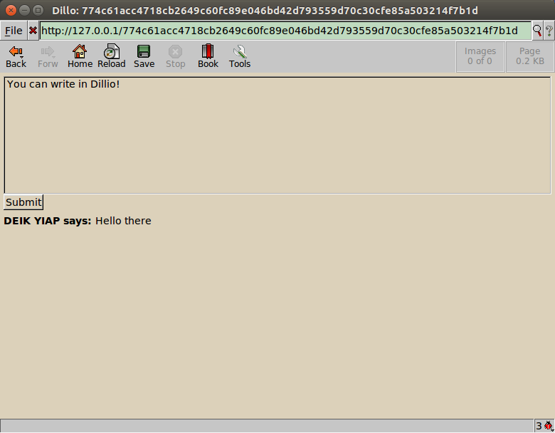
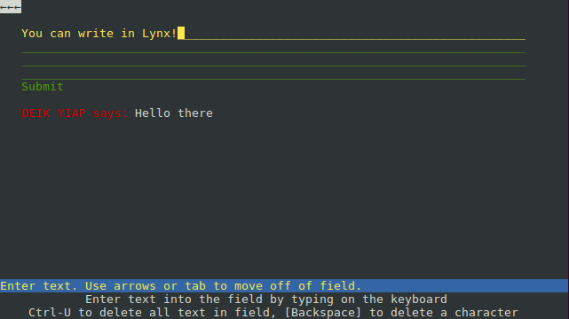

# Free Comment

       __  __
    \ |__ |  
    / |   |__

## What Is?

This project is about allowing simple HTML pages to have a free and open source
commenting system on their website with minimal load times. We have the
following requirements of this project:

  * Clients don't require JavaScript
  * Users should be able to post anonymously
  * The system should be free
  * Basic effort to prevent spam comments
  * Only requires basic HTML to be embedded into a page
  * Fast response time
  * Safe to use

## Use

To start, simply start the server:

    java -jar fc.jar

Now navigate to `http://127.0.0.1/generate`. You should see something like:

    Generated new link! It's available at:127.0.0.1/774c61acc4718cb2649c60fc89e046bd42d793559d70c30cfe85a503214f7b1d

Navigate to the address... Some examples of what you can expect:

To use in a webpage, simply embed the page in your page:

    <iframe src="http://127.0.0.1/774c61acc4718cb2649c60fc89e046bd42d793559d70c30cfe85a503214f7b1d"></iframe>

It's as simple as that! Comments - for everybody!

## Downloads

The latest downloads can be found in the
[releases](https://github.com/danielbarry/free-comment/releases) section.

## Bugs

Please refer to the
[issues](https://github.com/danielbarry/free-comment/issues) section for a list
of bugs.

## License

Please refer [here](license.md) for all licensing related issues.

## Contact

Please use the [issues](https://github.com/danielbarry/free-comment/issues)
section of the repository.
